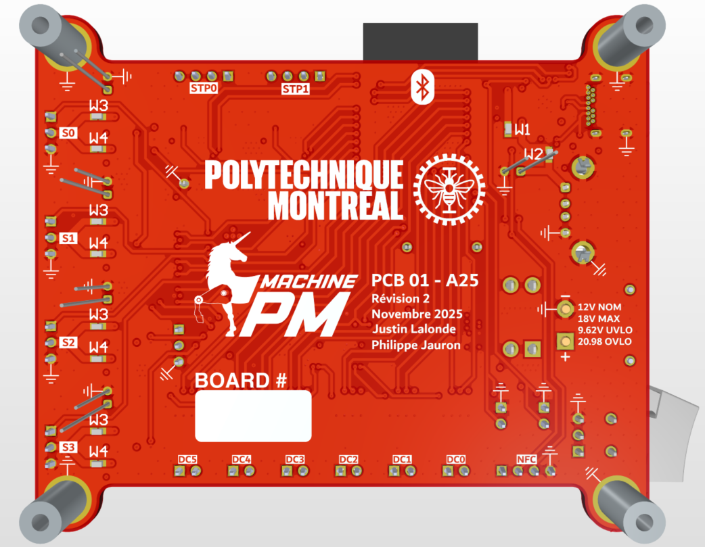

# MachinePM - Robot PCB
A versatile ESP32-based PCB for wireless robot control used in the 2026 Quebec Engineering Games by the Polytechnique Montreal delegation's [MachinePM](https://www.facebook.com/MachinePM/) team

  
  &nbsp;&nbsp;
  

# Project overview
The PCB is an ESP32-based robot motherboard which can control up to :
- Six 12V DC motors (up to 3.7A);
- Four 5V/7V servomors (PWM control);
- Two 12V stepper motors;

The board offers many other connectivity options with its 5V I2C interface, two external buttons, USBC upstream facing port for programming / debugging of the ESP32 along with its USBA downstream facing port for connecting a wireless controller's USB dongle, among other possibilities. Along with the ESP32's Bluetooth / Wi-Fi antenna, an on-board RGB-LED and an on/off rocker switch, this board truly is a solid and versatile platform for quick robotics prototyping. 

  
  &nbsp;&nbsp;
  

This board was designed to be used on four distinct and very different robots. It had to meet combined the needs of all four, which placed design focus on reliability, versatility and inter-operability between robots in case of failure. The perfect expample would be the feature where, with a simple DIP-switch, see the right-side image above, the user can switch the power supply to any servomotor channel from 5V to 7V.

  
  &nbsp;&nbsp;
  
  &nbsp;&nbsp;
  

This electronics platform played a huge role in enabling the team to design a robotics solution on a larger scale than ever before and contributed to the team winning **third place at the Machine Challenge of the Quebec Engineering Games 2026**. For more context on the project's results and associated awards, please see [this LinkedIn post](https://www.linkedin.com/posts/justin-lalonde-26bb49305_apr%C3%A8s-huit-mois-de-travail-intensif-je-suis-ugcPost-7419548842389381120-tLYX/?utm_source=share&utm_medium=member_desktop&rcm=ACoAAE3yFjMBjUuSvDgIEjEyuwl7U7Dr1T2H0Y8) (post is in French).

# Technical overview
This project consists of a 4-layer PCB designed with ALtium Designer. With its 

