# MachinePM - Robot PCB
A versatile _ESP32_-based PCB for wireless robot control used in the 2026 [Quebec Engineering Games](https://jeuxdegenie.qc.ca/en/) by the Polytechnique Montréal [MachinePM](https://www.facebook.com/MachinePM/) robotics team.

**September 2025 - December 2025**

  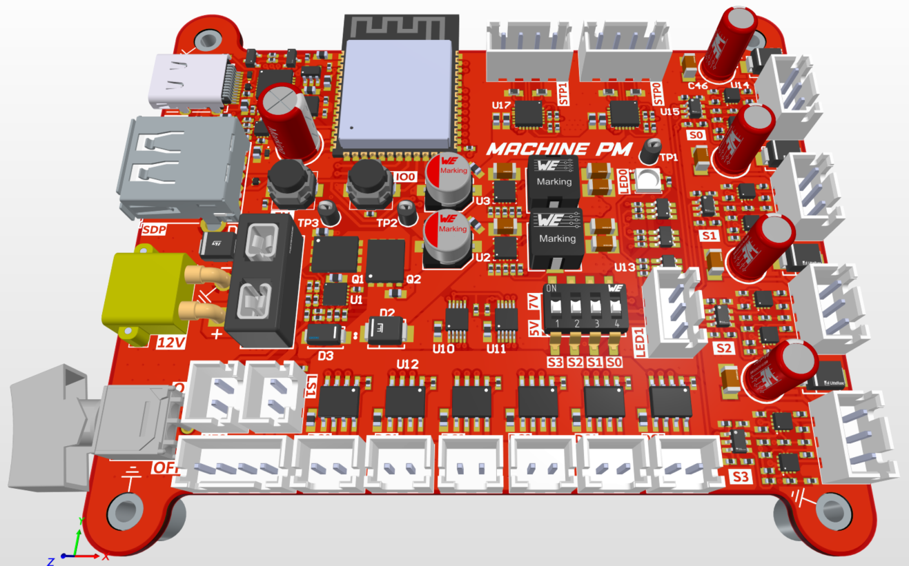
  &nbsp;&nbsp;
  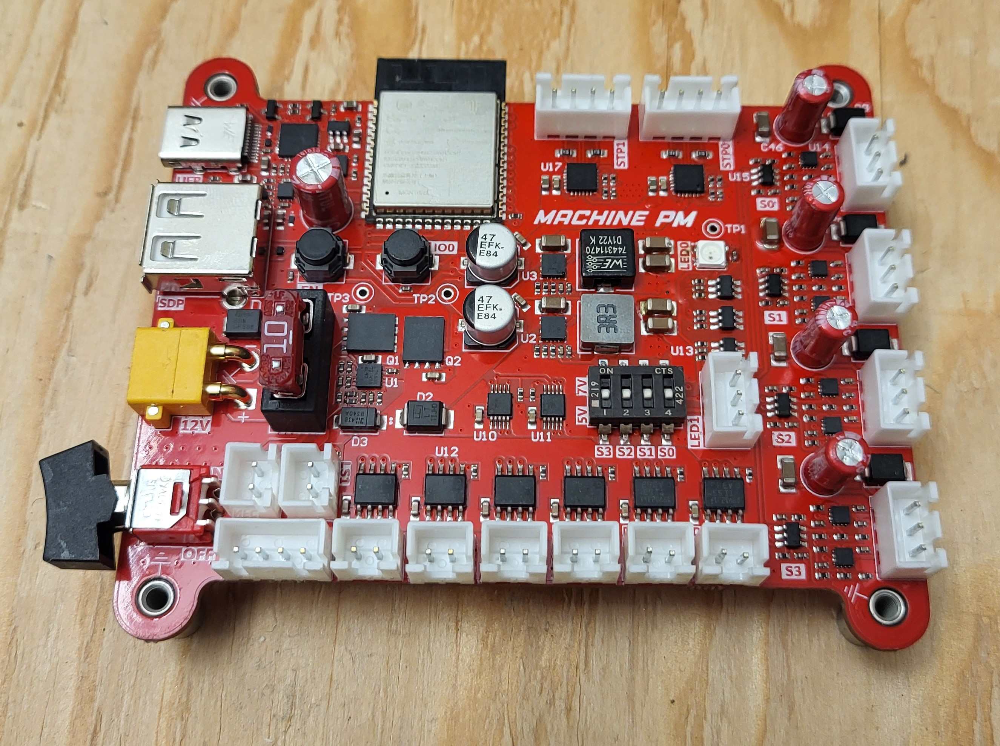

# Project overview
Each year, the _Machine_ Challenge of the _Quebec Engineering Games_ brings together engineering students from 12 universities across Quebec to design a robotics solution to a newly announced challenge within a four-month development period. As a member of _MachinePM_, a Polytechnique Montréal student robotics team, I was responsible for designing a versatile PCB intended to serve as the electronics platform for the team's robots during the 2026 competition.

Compared to the electronics used in previous years, this new platform represented a significant step forward in both functionality and size. Since multiple robot concepts were being developed in parallel, the PCB had to accommodate a wide range of hardware configurations while remaining easily interchangeable between robots. As a result, the design focused on versatility and interoperability. For example, each servomotor channel can be configured to operate from either a 5 V or 7 V power rail using a simple DIP switch, allowing the board to be quickly adapted to different servo models without any hardware modifications.

  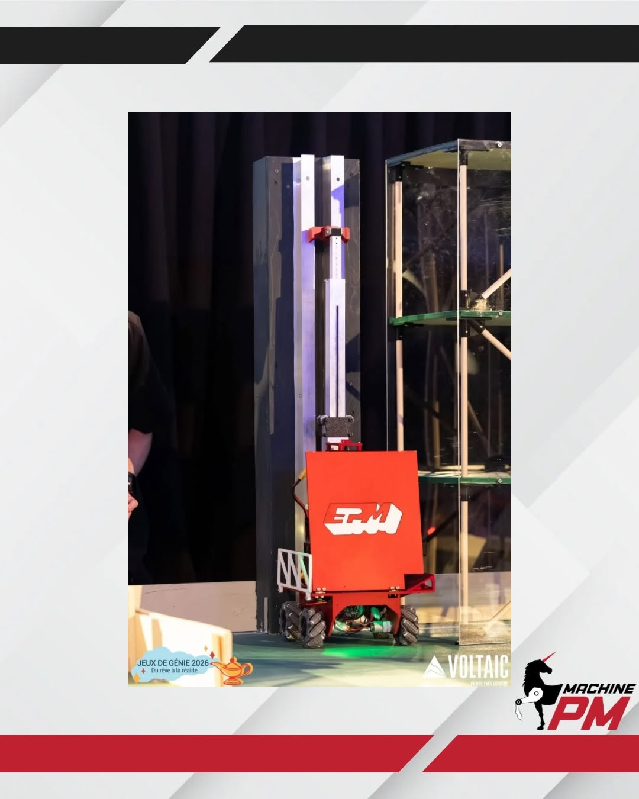
  &nbsp;&nbsp;
  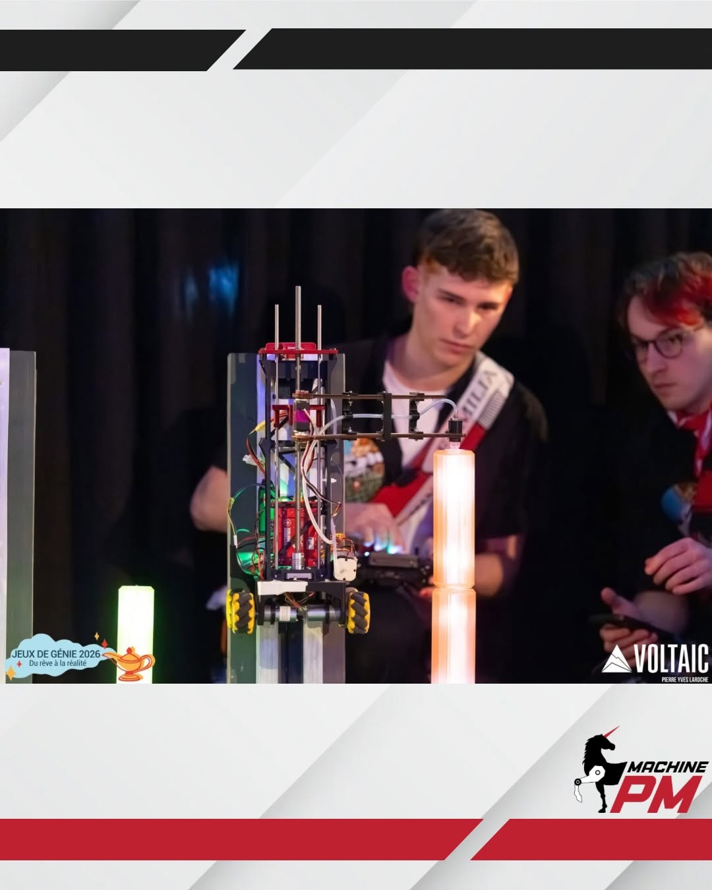
  &nbsp;&nbsp;
  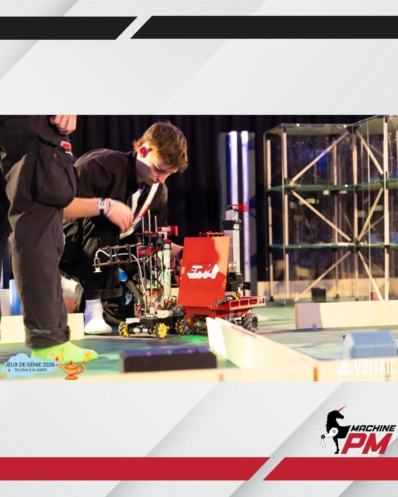

This electronics platform became the foundation of the team's robotics system and enabled the development of more capable and reliable robots than in previous years. It contributed to _MachinePM_ earning third place in the Machine Challenge at the 2026 _Quebec Engineering Games_. Additional context on the project and an award won thereafter can be found in [this LinkedIn post](https://www.linkedin.com/posts/justin-lalonde-26bb49305_apr%C3%A8s-huit-mois-de-travail-intensif-je-suis-ugcPost-7419548842389381120-tLYX/?utm_source=share&utm_medium=member_desktop&rcm=ACoAAE3yFjMBjUuSvDgIEjEyuwl7U7Dr1T2H0Y8) (post in French).

# Key features

The PCB acts as a robot motherboard, which can control up to:
- Six 12V DC motors (up to 3.7A)
- Four 5V/7V servomotors (PWM control);
- Two 12V stepper motors (up to 1.4A);

The board can be powered by any DC voltage source between 9.6V and 21.0V as long as the supply can handle the combined power of every connected motor and peripheral. 3S lithium-ion batteries (11.1V nominal) were used during the competition.

Other than the motor channels, the board offers many other connectivity options, such as:
- One I2C interface;
- Two headers for external switches;
- One USB-C upstream-facing port (UFP) for programming and debugging of the _ESP32_;
- One USB-A downstream-facing port (DFP) for connecting a wireless controller's USB dongle, among other possibilities;
- One external lighting header, to connect LED strips, for example;

Along with the _ESP32_'s Bluetooth / Wi-Fi antenna, an on-board RGB LED, and an on/off rocker switch, this board acts as a solid and versatile platform for quick robotics prototyping. 

  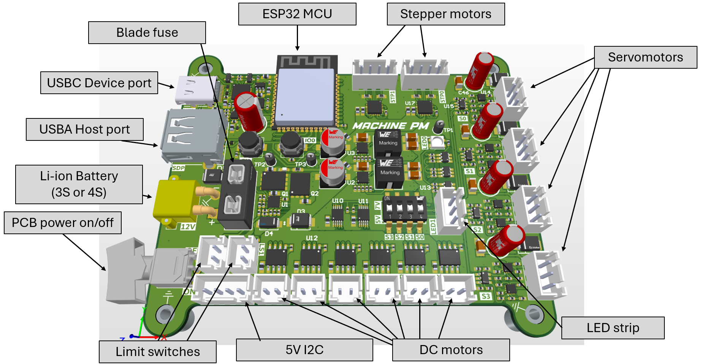

# Hardware architecture
This project consists of a 4-layer PCB designed using _Altium Designe_r. It implements an _ESP32_ microcontroller module ([ESP32-S3-WROOM-1-N16R8](https://documentation.espressif.com/esp32-s3-wroom-1_wroom-1u_datasheet_en.pdf)) and many more integrated circuits.

  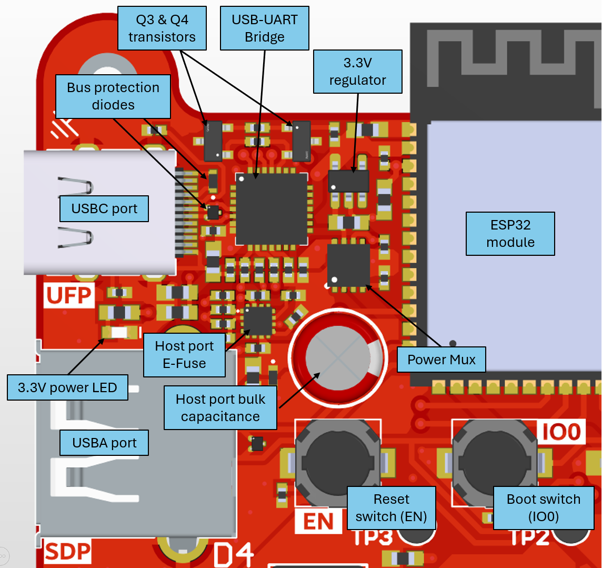
  &nbsp;&nbsp;
  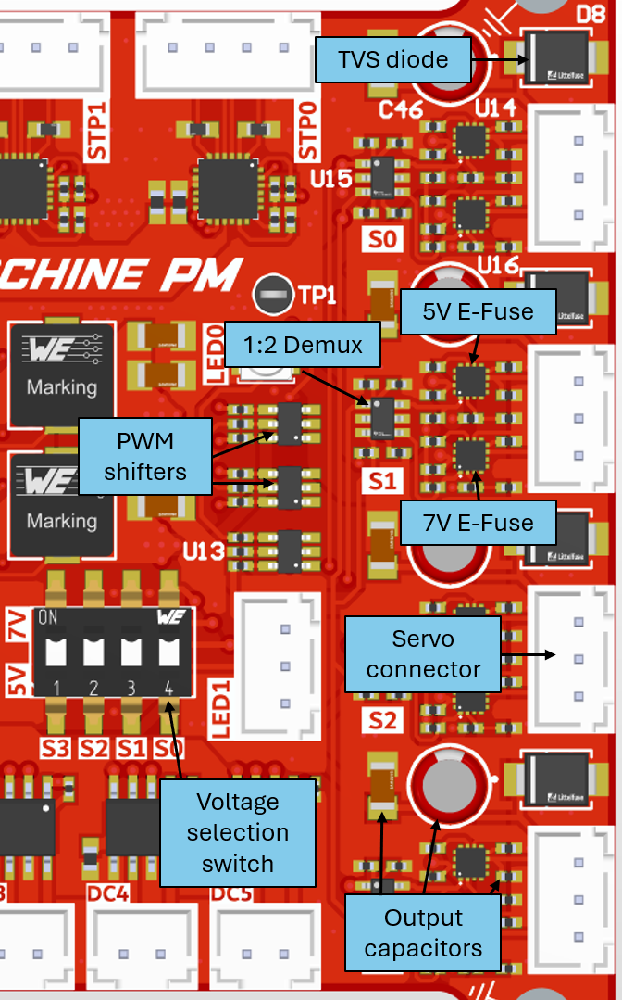

**POWER STAGES**:
1. The input voltage from the connected DC power supply (battery) first goes through an input protection / switching stage. This input stage implements undervoltage, overvoltage, and inrush current protections and enables the rocker switch to completely cut off supply to the rest of the board ([LM74800](https://www.ti.com/lit/ds/symlink/lm7480-q1.pdf?HQS=dis-dk-null-digikeymode-dsf-pf-null-wwe&ts=1783701329776)).
2. The input voltage is then fed into the DC motor driver ICs ([DRV8231](https://www.ti.com/lit/ds/symlink/drv8231.pdf)) as well as the stepper motor driver ICs ([DRV8846](https://www.ti.com/lit/ds/symlink/drv8846.pdf?ts=1783761254264)).
3. This same input voltage is also converted to 5V as well as 7V using two of the same switching regulator ICs in buck converter topologies ([TPS56A37](https://www.ti.com/lit/ds/symlink/tps56a37.pdf?ts=1783737334153)).
4. These 5V and 7V power rails are then multiplexed by two E-Fuse ICs ([TPS249474](https://www.ti.com/lit/ds/symlink/tps25947.pdf?ts=1783753086040)) for each servomotor channel. By interacting with the 4-channel DIP switch, the user can select which of the two supply rails powers any one of the four servomotors connected to the board (see image above). These E-Fuse ICs also implement independent reverse current, overcurrent, and inrush current protections for each supply.
5. The same 5V supply is also routed into the USB-A host port, reusing the [TPS249474](https://www.ti.com/lit/ds/symlink/tps25947.pdf?ts=1783753086040) for protecting the connected downstream devices, and is multiplexed with the bus voltage of the USB-C device port using a power multiplexer IC ([TPS2115](https://www.ti.com/lit/ds/symlink/tps2115.pdf?ts=1783787434649&ref_url=https%253A%252F%252Fwww.ti.com%252Fproduct%252FTPS2115)) before being regulated to 3.3V ([TLV75733](https://www.ti.com/lit/ds/symlink/tlv757p.pdf?ts=1783787499434&ref_url=https%253A%252F%252Fwww.ti.com%252Fproduct%252FTLV757P%252Fpart-details%252FTLV75733PDRVR)) to power many digital ICs present on the board, such as the _ESP32_ module itself. This power multiplexing is to ensure that the microcontroller can be programmed with a single USB-C connection without the need for the main power source.

DIGITAL ICs:
1. Serial communication with the _EPS32_ requires a _USB-To-UART_ bridge IC ([CP2102N](https://www.silabs.com/documents/public/data-sheets/cp2102n-datasheet.pdf)).
2. Two _Analogue-to-Digital_ _Converter_ (ADC) ICs are also present on the board to read the power rails and analogue signals generated by various ICs ([ADS1015](https://www.ti.com/lit/ds/symlink/ads1013.pdf?HQS=dis-dk-null-digikeymode-dsf-pf-null-wwe&ts=1783787787332&ref_url=https%253A%252F%252Fwww.ti.com%252Fgeneral%252Fdocs%252Fsuppproductinfo.tsp%253FdistId%253D10%2526gotoUrl%253Dhttps%253A%252F%252Fwww.ti.com%252Flit%252Fgpn%252Fads1013)).
3. A level shifter / signal buffer IC was also implemented to isolate the _ESP32_ GPIOs from the servomotors by shifting its PWM signal to a 5V logic level ([SN74LVC2G17](https://www.ti.com/lit/ds/symlink/sn74lvc2g17.pdf?ts=1783718395322)).
4. A 1-to-2 demultiplexer was used to enable the user-actioned DIP switch to select only one of the two E-Fuses, which handle the 5V and 7V supplies to the servomotor channels ([SN74LVC1G18](https://www.ti.com/lit/ds/symlink/sn74lvc1g18.pdf?ts=1783788025016&ref_url=https%253A%252F%252Fwww.google.com%252F)).

# Future improvements
Although the board works well as it is, some hardware behaviours can be improved. Here are two:

1. The E-Fuse IC [TPS249474](https://www.ti.com/lit/ds/symlink/tps25947.pdf?ts=1783753086040), which is used to protect the PCB from servomotor reverse current or voltage spikes, implements a user-programmed blanking interval, which sets the time for which the IC will ignore an overcurrent event before triggering its protection. This _ITIMER_ pin associated with this setting was left floating in the design (see image below), which means that E-Fuse reacts with its fastest response time to overcurrent events. This has proven to be problematic after testing with larger servomotors, which have brief but significant current spikes, which trigger the E-Fuse's latch-off protection and disable the motor channel entirely. Adding an appropriately sized capacitor to the _ITIMER_ pin would resolve this issue in future revisions.
2. An _RC_ low-pass network could be added to the limit-switch input pins of the _ESP32_ to filter noise and false detections, which halt a robot's actuators in firmware.

  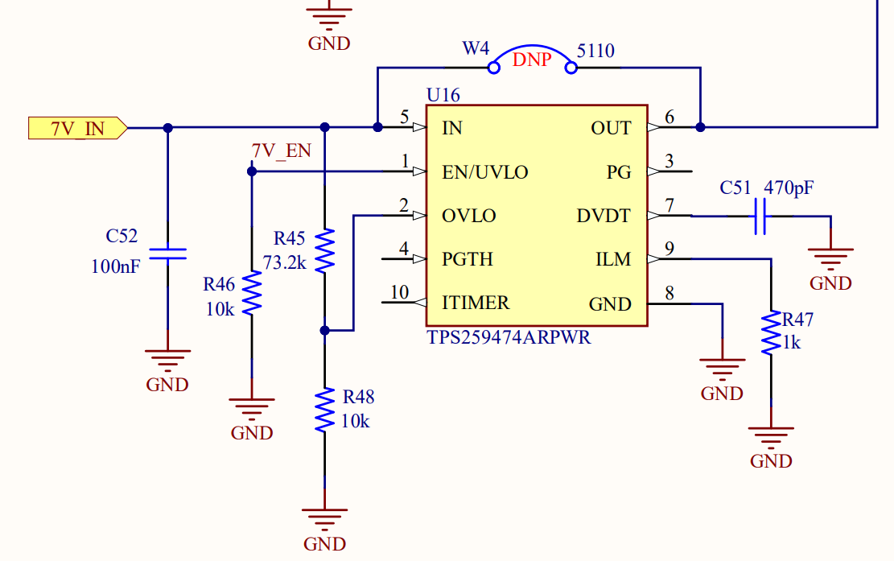

# Documentation
You can find the full PCB schematics as well as the project report (report in French) under the [Documentation](https://github.com/justinlalonde/MachinePM---Robot-PCB/tree/main/Documentation) folder.

  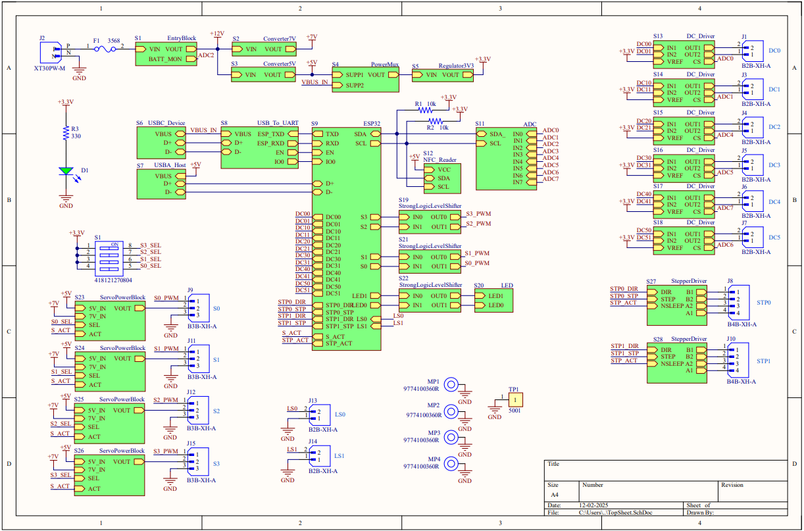
  &nbsp;&nbsp;
  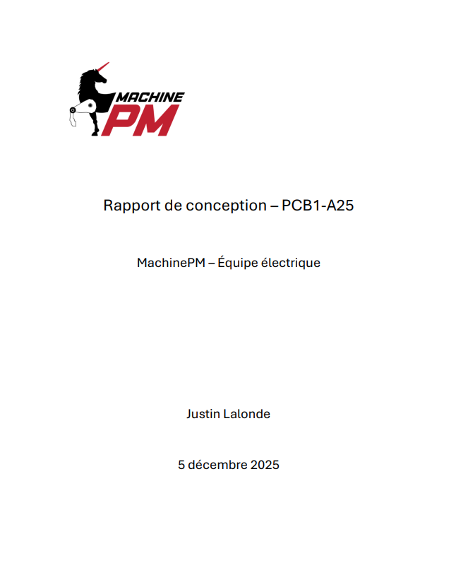

